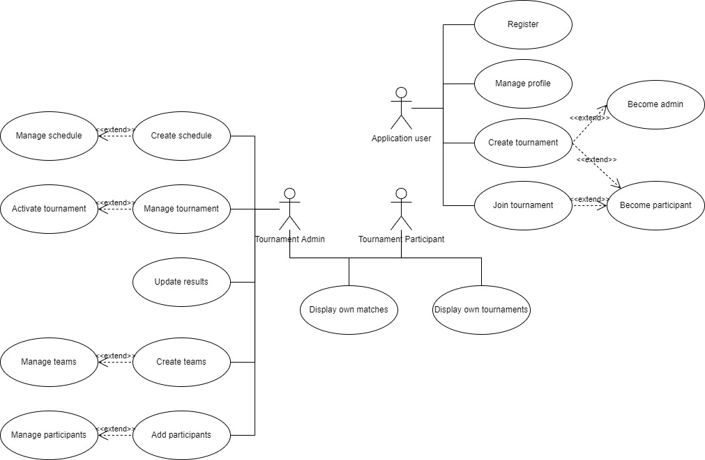
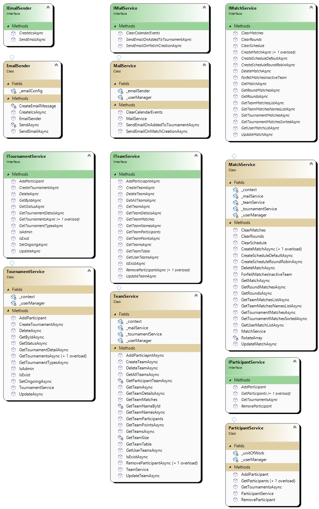

**Project:** Tournament App

**use update-database from pkm to update the db to the latest migration and**
**edit the appsettings.json file with your connection string and email service credentials before running**

**Introduction:**

Our selected project -- "TournamentApp" is a tournament management (web)
application.

The purpose of the application is to allow people (users) to group
together, create and keep track of tournaments, as a web-service
designed to replace the current conventional ways of doing so --
notebooks, dedicated WhatsApp groups, keeping lists and notes and other
un-convenient and un-focused solutions.

We provide an interactive, intuitive application that allows users to
have an entire process of registration (one-time for the app, not for
each tournament), tournament and team creation, automatic scheduling,
and notification (creation phase) and providing ranking tables,
convenient methods to update and keep track of matches and scores
(on-going tournament phase) while using the minimum number of operations
to do each action.

As mentioned before, we focused both on the performance of the
application while paying a lot of attention to the user-experience and
design fields.

The system is a web-based application which means that it can be
accessed from almost anywhere and any hardware, doesn't require
additional storage and is not limited to a certain operating system.

**Screens**

Landing page -- login to use the app or register:

{width="5.342328302712161in"
height="3.87327646544182in"}

Register / create a new user:

{width="5.371246719160105in"
height="3.878176946631671in"}

Home page:

{width="5.351668853893264in"
height="3.9411198600174977in"}

Tournaments page:

{width="5.364885170603674in"
height="3.8926027996500436in"}

New tournament creation:

{width="5.39968394575678in"
height="3.889734251968504in"}

Tournament management (If admin):

{width="5.4444706911636045in"
height="3.023231627296588in"}

Manage teams:

{width="6.273066491688539in"
height="2.865483377077865in"}

Manage team (Edit):

{width="6.268055555555556in"
height="3.6979166666666665in"}

Add a participant to a team:

{width="6.268055555555556in"
height="3.6951388888888888in"}

Manage user profile:

{width="6.268055555555556in"
height="4.4847222222222225in"}

Tournament schedule and schedule creation options:

{width="6.268055555555556in"
height="4.180555555555555in"}

Current tournament details:

{width="6.268055555555556in"
height="4.552777777777778in"}

**Actors**

{width="2.8333333333333335in"
height="2.1041666666666665in"}

**Use case**

{width="6.270833333333333in"
height="4.09375in"}

**Class Diagrams**

**Database and model structure:**

{width="6.268055555555556in"
height="6.376388888888889in"}

**Services:**

{width="5.788978565179352in"
height="9.21875in"}

**Dtos:**

{width="6.268055555555556in"
height="8.100694444444445in"}

**Physical architecture**

[As we are deployed on the cloud, in this section we demonstrate a
scenario where we change the architecture to a physical
one.]{.underline}

Due to the expectation to be used by many users and the need to support
them even at the worst case - all at once, the physical architecture
must be scalable and monitored for the need of scaling.

The hardware needs are simple, at the first phase 4 database servers
will be sufficient -- a "main" working server and another back-up server
for the identity, authentication (2 servers) and for the rest of the
database (other 2 servers). The system must apply active and constant
backup and we do not expect a need for load scattering in the early
stage after the deployment and launch of the application.

The application itself is not heavy and will not require strong hardware
and is not supposed to be constantly updated (mostly scaling and some
new features) and will require, again, 2 servers in the early stage
(main and backup).

As mentioned above, backups must be constant so that disaster recovery
will be useful. For disaster recovery we have several cases:

1.  Database disaster -- here, in most cases the backup database will be
    used (route into). For most database disasters we would like to back
    up the database only after an action succeeds and create checkpoints
    for local restoration. A feature of time stamp comparison between
    the latest checkpoint locally and at the backup database can be
    applied for better, faster, and safer restoration.

2.  Application disaster -- we can expect application disasters mostly
    after version updates. To tackle that we can keep checkpoints and
    when a need to recover arises, the back up server will be used at
    the latest checkpoint (unless it is not possible to due to conflicts
    etc.)

3.  Overload disasters -- we expect to tackle that area before it
    happens by monitoring the number of users using the application and
    applying scaling ahead of time.

As for data security, the Identity API provides password hashing, as the
password is the only sensitive data in our servers. For extra security
and enhanced privacy, we will not expose personal information other than
the username and will host the personal information in a different,
separate database and server.

{width="1.9427755905511812in"
height="1.7792202537182853in"}

\<\<PC -- Client\>\> \<\<Server\>\> \<\<DataBase\>\>

**\
**

**Logical architecture**

Our application is a web application, developed mostly using C# (.Net 6)
with some HTML/JS/jQuery/CSS at the client side.

We used the Razor Pages framework due to it being dynamic and
cross-platform, includes the advanced features of ASP.NET core, uses C#
(both in front and back end). Razor Pages uses page controllers (opposed
to front controllers as in MVC) that provide GET and POST options and
route to different Views (display HTML) or Models (domain logic).

The logic was implemented using various services (Interfaces and
concrete implementations) to make the code more generic, less dependent
on implementations and used resources and more layered and separated.
The main guideline was to treat each area of the application as a black
box, as independent as possible from concrete implementations and
specific resources. In addition to those services, we used several Dtos
to display/receive data to/from the user when needed to use "lighter"
entities.

The database we chose is Microsoft SQL Server, due to its structure and
our familiarity with the technology. For integration between the server
and the application we used migrations, scaffolding, and Entity
Framework to link the database to the Models used in the backend. With
that being said -- the database technology can be easily replaced by
creating different services classes (implementing the interfaces) and
using the right technology's access code.

For authentication and authorization, we used the ASP.NET Core Identity
API while segmenting and filtering the fields and logic we needed for
our use.

The mail service was implemented as an independent API, we created a
Gmail account for the app and set up SMTP connections to send important
messages to users.

**Main processes**

1.  **Registration**

The application demands a valid user login, to do so the user must
register an account. The account information must be valid (basic
validation, incorrect input messages will be displayed).

2.  **Login**

A user must login to use the application.

3.  **Authorization and authentication**

Throughout the application there are background processes that handle
authentication and authorization, that is to avoid access to pages and
actions that an unregistered user or an unlicensed user (not an admin)
is not supposed to perform.

4.  **Tournament creation**

Any user can create his own tournament, define the size of the teams and
the starting and end (optional) date. We currently only support a basic
league style tournament and will add more options (knockout, elimination
variations etc.) in the future versions of the application.

5.  **Tournament management**

A user who is an admin of a tournament can manage the tournament. If
allowed to, the user can change the tournament details, information,
manage the teams and set the tournament to 'Active' to create the
schedule using 2 automatic algorithms or manually by adding matches.

In addition, the admin will be able to set teams as 'Inactive' that will
trigger a process that forfeits their matches. In addition, the admin
has the responsibility to update the result of each match played.

6.  **Team creation**

The admin will be able (and will have to) create teams and fill them
with participants. The number of teams is flexible but the size (number
of participants) of each team is determined in the creation phase.

7.  **Schedule**

    a.  **Manual match scheduling**

> Manual match creation, selecting the 2 teams and setting the match
> date

b.  **Naïve algorithm**

> A naïve algorithm will create a single match between each 2 teams with
> default following dates.

c.  **RR algorithm**

> The round-robin algorithm is a more complexed algorithm for schedule
> creation. The outcome is 2 matches between each pair of teams, setting
> the match dates to be a monotonic ascending series, with 2 matches on
> each day, starting from the first day of the tournament.

8.  **Messaging**

A mail messaging service will send e-mails with '.ics' files to each
participant when added to a tournament and to a match.

**Testing**

Most of the tests we used in our project were manual tests, challenging
edge-cases for each functionality that the application supports.

"Simple" tests were solved ahead of time by implementing validation and
verification methods for each human-error-prone part of the project. The
main difficulty was testing the possible routing exceptions, since we
are using the query string in most of our project we had to (after Tamir
pointed that in one of the sprint reviews) try and find those routing
exceptions manually, by triggering those different possible anomalies
manually.

We performed integration tests between the database and the application
on each change performed to either one of that that might have damaged
the integration in some way.

Due to the simplicity of the system, we were able to perform end to end
tests on each feature creation/modification and it allowed us to
manually perform the entire (specifically planned testing suite)
"Tournament pipeline" with ease (Multiple registration, tournament
creation, adding teams and creating schedule) for each pipeline,
depending on the existing features at that specific phase of the
project. During each of those end-to-end tests we tried to challenge the
integrations, validation needed location, routing and logical failing
possible scenarios while handling each bug/error "on spot".

By performing those "complete" tests we were able to keep track of bugs
and test each other's features/code for cross validation of the
correctness.

In addition to that, we used GitHub Actions' CI abilities to verify pull
requests and push integrity.

**Process of work throughout the year**

The process of development was performed by simulating (as close as we
can, since still -- it was not our only day-job) the agile methodology
by working in 5 sprints, each taking two-weeks throughout the semester.
Each sprint was pre-planned to achieve a completion of an entire feature
and business value. In addition to the weekly (Tuesdays in class) we had
a "semiweekly" on Saturdays as a team.

For the scheduling and planning we used Azure Devops platform. At the
beginning of the semester, we created the general features and backlog
items and chose the specific ones before the beginning of each sprint
while adding specific instructions at that time.

We used Git (GitHub) for source control, working on different branches
to take advantage of parallel and un-dependent development (when it was
possible) and carefully merging those different versions when needed (We
saw that as a way to "verify" our "good" planning -- we almost had no
conflicts, meaning that the work was really divided in a good way while
allowing each team member to focus on his work without being dependent
of others.

In addition to those two tools, we had a WhatsApp group where we shared
instant messages, resources, updates, and reports and used Zoom or
Google Meets for our team meetings.

The work was divided according to the team members' strengths, while
still trying to let each team member "touch" each area in the
development process (backend, frontend, database, testing, design) the
job was still divided to play to the members' strengths, for example
letting the "stronger" backend developers develop more of the backend
etc.

We have put emphasis on working together and taking big, important
decisions together -- methodology of work, technology, etc., while
letting each developer work as he prefers in the code-level.
